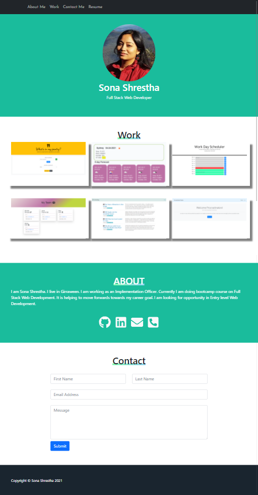

# React: React Portfolio

### Table of Contents

- [Description](#description)
- [Contribution](#contribution)
- [License](#license)

## Description

- This is my portfolio website using react.
- The website contains my name, recent photo and links to sections about me, my work and how to contact me.
- When the navigation links are clicked, the UI scrolls to corresponding section.
- when clicking on the images in the work section, then links to corresponding projects.
- The resume can be downloaded from Resume header navigation.

## Mock up

- The following images shows the appearance of website on different devices

## Desktop

## Iphone X

## Ipad Pro

## Technology used

React, HTML, CSS, Bootstrap

## Link to deployed application

https://sona29.github.io/react-portfolio/

## Contribution

Please feel free in making contribution to this repository. But please first discuss the change via email with me. I will try to get back to you as soon as possible.

## Questions

If you have any questions feel free to contact me:

Github Username: sona29

Email: sona.shrestha004@gmail.com

## License

